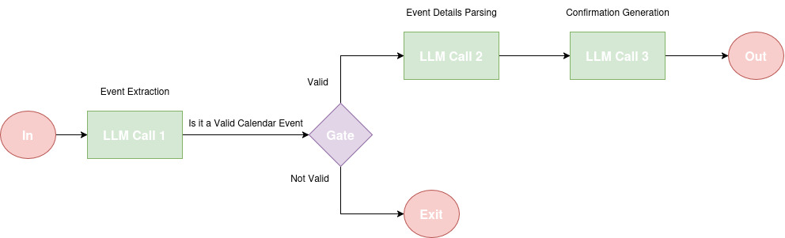

# AI-Powered Calendar Event Processing Agent

## Overview
This AI agent is designed to intelligently extract, interpret, and confirm calendar event details from natural language inputs. It leverages OpenAI's GPT-4o model to analyze user inputs, determine whether they describe calendar events, extract event details, and generate confirmation messages.

## Understanding AI Agents
An AI agent is a software system that perceives its environment, processes inputs, and takes actions to achieve specific goals. This agent follows a **prompt chaining workflow** to guide the AI through multiple stages of processing, ensuring accuracy and reliability in handling calendar event requests.

## Features
- **Event Detection**: Identifies whether an input describes a calendar event.
- **Event Parsing**: Extracts structured details such as event name, date, time, duration, and participants.
- **Confirmation Generation**: Produces a natural language confirmation message for the user.
- **Logging & Debugging**: Uses Python’s logging module for enhanced debugging and transparency.

## Prompt Chaining Workflow



The agent follows a **three-step prompt chaining approach** to systematically extract and process information:

1. **Event Extraction**: The first AI call determines if the input describes a calendar event with a confidence score.
2. **Event Details Parsing**: If identified as a calendar event, a second AI call extracts specific details like date, time, and participants.
3. **Confirmation Generation**: The final AI call formats a confirmation message, ensuring clarity and usability for the user.


This stepwise approach improves the accuracy and reliability of the AI's responses.

## Technologies Used
- **Programming Language**: Python
- **AI Model**: OpenAI GPT-4o
- **Frameworks & Libraries**:
  - `pydantic` for structured data validation
  - `datetime` for handling event dates
  - `logging` for structured debugging and monitoring
  - `os` for environment variable management

## Installation & Setup
1. Clone the repository:
   ```bash
   git clone https://github.com/your-repo/Calender-AI-Agent.git
   cd Calender-AI-Agent
   ```
2. Install dependencies:
   ```bash
   pip install openai pydantic
   ```
3. Set up environment variables:
   ```bash
   export OPENAI_API_KEY="your-api-key"
   ```
4. Run the script:
   ```bash
   python main.py
   ```

## Usage Example
You can test the agent with various inputs, such as:
```python
user_input = "Let's schedule a 1h team meeting next Tuesday at 2pm with Alice and Bob to discuss the project roadmap."
result = process_calendar_request(user_input)
```
If the input is a valid event, the AI will generate a confirmation message and a calendar link if applicable.

## Potential Enhancements
- **Integration with Google Calendar** to auto-create events.
- **User authentication** to personalize responses.
- **Multi-language support** for broader accessibility.

## Conclusion
This AI agent showcases the power of **prompt chaining** to break down complex natural language inputs into structured event details. By iteratively processing information, it ensures high accuracy and seamless user experience in scheduling calendar events.

---
Developed by: Muhammad Nagy
